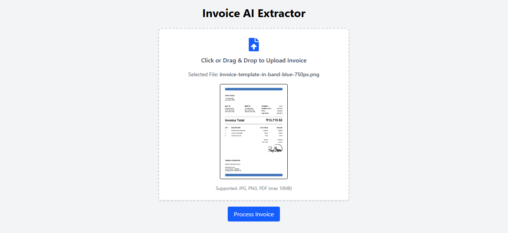

# 🧾 Invoice Extractor

A full-stack web application that extracts structured invoice data from uploaded images (JPG, PNG, PDF) using OCR (Tesseract.js) and Large Language Models (e.g., GPT). The app highlights extracted fields such as invoice number, date, supplier name, total amount, line items, and tax info, along with confidence scores for each.

---



🔗 **Live Demo**: [https://invoice-extractor-ai.onrender.com/](https://invoice-extractor-ai.onrender.com/)

## 📸 Features

- Upload invoice in JPG, PNG, or PDF format
- OCR-based text extraction from images and PDFs
- Structured JSON output using LLM prompts
- Confidence scores for each extracted field
- Displays data in a user-friendly frontend
- Responsive UI with loading states
- Error handling for unsupported formats and malformed files

---

## 🧑‍💻 Tech Stack

### Frontend
- React.js
- Tailwind CSS

### Backend
- Node.js
- Express.js
- Multer (file handling)
- Tesseract.js (OCR for images)
- pdf-parse (text extraction from PDFs)
- Groq API (for LLM-based extraction)

---

# 🚀 Getting Started

## 1. Clone the repo
```bash
git clone https://github.com/aayush-sharma001/invoice-extractor.git
cd invoice-extractor
```

## 2. Install dependencies

### Backend
```bash
cd server
npm install
```

### Frontend
```bash
cd ../client
npm install
```

## 3. Set environment variables
Create `server/.env` file with:
```env
PORT=5000
GROQ_API_KEY_API_KEY=your_groq_key
```

## 4. Run locally

### Start Backend
```bash
cd server
npm run dev
```

### Start Frontend
```bash
cd ../client
npm start
```

Access the application at: [http://localhost:5173](http://localhost:5173)